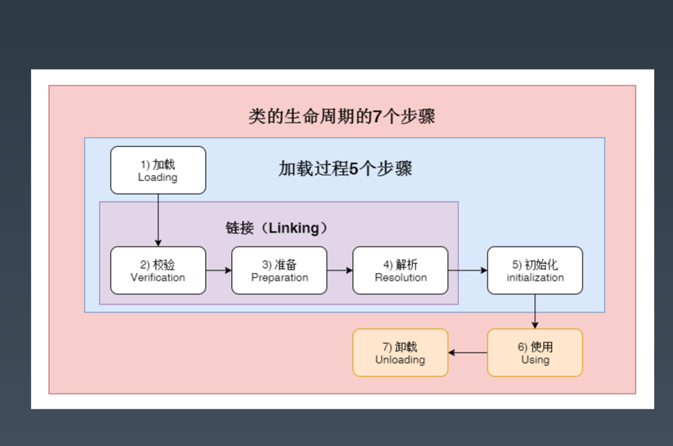
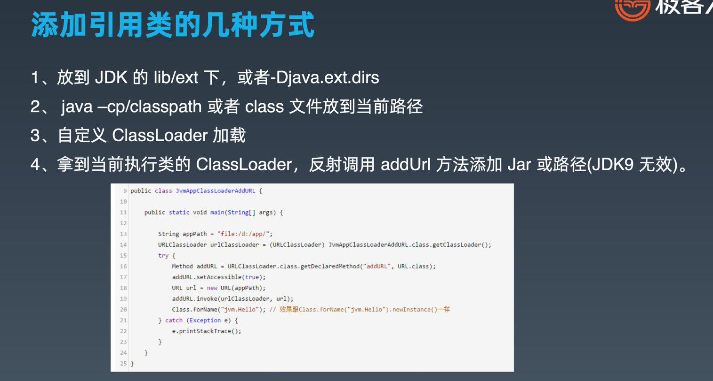
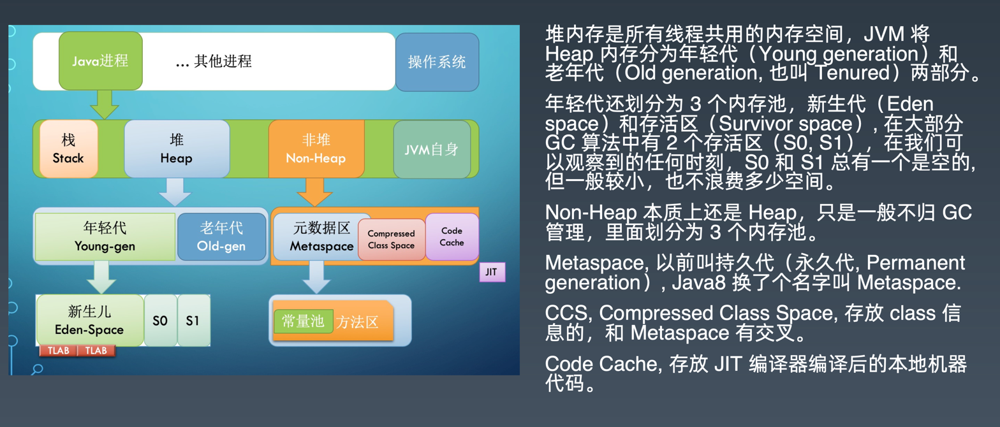
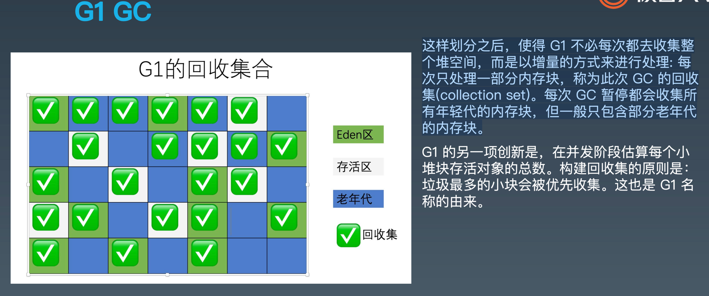
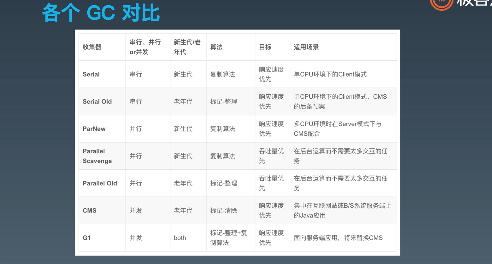
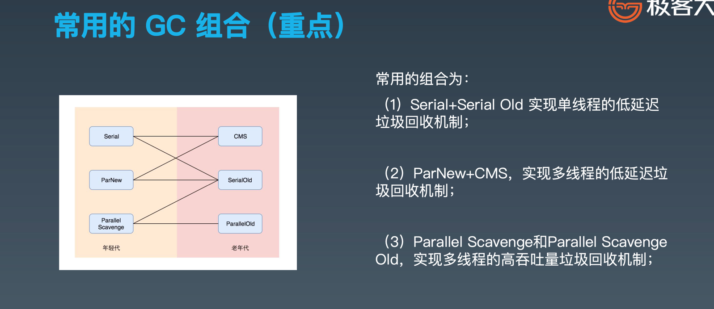

学习笔记

## 字节码
- 为啥叫字节码，因为java最早都是用在简单的设备，为了效率，命令长度不超过一个字节，即不超过256种
- 字节码主要都是局部变量表和 栈结构的交互，牵涉到load 和 store命令

## 栈帧

- 每一次方法调用，JVM 都会自动创建一个栈帧。 
- 栈帧由操作数栈， 局部变量数组以及一个 Class 引用组成。 Class 引用 指向当前方法在运行时常量池中对应的 Class

## 方法调用的指令

- invokestatic，顾名思义，这个指令用于调用某个类的静态方法，这是方法调用指令中最 快的一个。
- invokespecial, 用来调用构造函数，但也可以用于调用同一个类中的 private 方法, 以及 可见的超类方法。
- invokevirtual，如果是具体类型的目标对象，invokevirtual 用于调用公共，受保护和 package 级的私有方法。
- invokeinterface，当通过接口引用来调用方法时，将会编译为 invokeinterface 指令。
- invokedynamic，JDK7 新增加的指令，是实现“动态类型语言”(Dynamically Typed Language)支持而进行的升级改进，同时也是 JDK8 以后支持 lambda 表达式的实现基 础。

## 类的生命周期


```js
 1. 加载(Loading):找 Class 文件
 2. 验证(Verification):验证格式、依赖
 3. 准备(Preparation):静态字段、方法表
 4. 解析(Resolution):符号解析为引用
 5. 初始化(Initialization):构造器、静态变 量赋值、静态代码块
 6. 使用(Using)
 7. 卸载(Unloading)
```



## 类的加载时机
```js
1. 当虚拟机启动时，初始化用户指定的主类，就是启动执行的 main 方法所在的类;
2. 当遇到用以新建目标类实例的 new 指令时，初始化 new 指令的目标类，就是 new 一个类的时候要初始化;
3. 当遇到调用静态方法的指令时，初始化该静态方法所在的类;
4. 当遇到访问静态字段的指令时，初始化该静态字段所在的类;
5. 子类的初始化会触发父类的初始化;
6. 如果一个接口定义了 default 方法，那么直接实现或者间接实现该接口的类的初始化， 会触发该接口的初始化;
7. 使用反射 API 对某个类进行反射调用时，初始化这个类，其实跟前面一样，反射调用 要么是已经有实例了，要么是静态方法，都需要初始化;
8. 当初次调用 MethodHandle 实例时，初始化该 MethodHandle 指向的方法所在的 类。
```

## 不会触发初始化但会加载的情形
```js
1. 通过子类引用父类的静态字段，只会触发父类的初始化，而不会触发子类的初始化。
2. 定义对象数组，不会触发该类的初始化。
3. 常量在编译期间会存入调用类的常量池中，本质上并没有直接引用定义常量的类，不 会触发定义常量所在的类。
4. 通过类名获取 Class 对象，不会触发类的初始化，Hello.class 不会让 Hello 类初始 化。
5. 通过 Class.forName 加载指定类时，如果指定参数 initialize 为 false 时，也不会触 发类初始化，其实这个参数是告诉虚拟机，是否要对类进行初始化。Class.forName (“jvm.Hello”)默认会加载 Hello 类。
6. 通过 ClassLoader 默认的 loadClass 方法，也不会触发初始化动作(加载了，但是 不初始化)。
```

## 加载器规则
- 双亲委派（优先从上到下）
- 负责加载 (加载当前类时，遇到依赖的类时，也由这个加载器处理)
- 缓冲加载


## 添加引用类路径方式


## java内存结构


## javaAgent
- 对class文件做出来，使得JVM得到的对象 是经过处理的

## jvm常用的命令行参数

- 标准参数 -server
- 非标准参数 -Xmx，-XX：xxxx=yyyy
- 系统属性-Dxxx=yyy（也可以用于隐式传参）

---
jvm内存配置经验：xmx ~ 不要超过系统可用内存的60-80%例如 系统有4g可用内存 -> 4g*0.6~0.8 -> 可以设置xmx为2.4~3.2g

## GC root对象
1. 当前正在执行的方法里的局部变量和 输入参数
2. 活动线程(Active threads)
3. 所有类的静态字段(static field)
4. JNI 引用

## GC策略
```js
串行GC
1. -XX:+UseSerialGC 配置串行 GC
串行 GC 对年轻代使用 mark-copy(标记-复制) 算法，对老年代使用 mark-sweep-
compact(标记-清除-整理)算法。

-XX:+USeParNewGC 改进版本的 Serial GC，可以配合 CMS 使用。

并行GC

-XX:+UseParallelGC
-XX:+UseParallelOldGC
-XX:+UseParallelGC -XX:+UseParallelOldGC

在年轻代使用 标记-复制(mark-copy)算法，在老年代使用 标记-清除-整理(mark-sweep- compact)算法。

-XX:ParallelGCThreads=N 来指定 GC 线程数， 其默认值为 CPU 核心数

并行的收集器收集效率最高

CMS收集器
其对年轻代采用并行 STW 方式的 mark-copy (标记-复制)算法，对老年代主要使用并发 mark-sweep (标记-清除)算法

CMS GC 的设计目标是避免在老年代垃圾收集时出现长时间的卡顿


G1收集器
G1 GC 是一款软实时垃圾收集器，可以 为其设置某项特定的性能指标。


堆不再分成年轻代和老年代，而是划分为多 个(通常是 2048 个)可以存放对象的 小块堆区 域(smaller heap regions)。
每个小块，可能一会 被定义成 Eden 区，一会被指定为 Survivor区或者 Old 区。在逻辑上，所有的 Eden 区和 Survivor 区合起来就是年轻代，所有的 Old 区拼在一起那 就是老年代≈


```
>一般jdk版本默认的GC 收集器就是并行收集器




## gc对比





### GC总结
1. 串行 -> 并行: 重复利用多核 CPU 的优势，大幅降低 GC 暂停时间，提升吞吐量。
2. 并行 -> 并发: 不只开多个 GC 线程并行回收，还将GC操作拆分为多个步骤，让很多繁重的任务和应用线程一 起并发执行，减少了单次 GC 暂停持续的时间，这能有效降低业务系统的延迟。
3. CMS -> G1: G1 可以说是在 CMS 基础上进行迭代和优化开发出来的，划分为多个小堆块进行增量回收，这样 就更进一步地降低了单次 GC 暂停的时间
4. G1 -> ZGC::ZGC 号称无停顿垃圾收集器，这又是一次极大的改进。ZGC 和 G1 有一些相似的地方，但是底层 的算法和思想又有了全新的突破。

